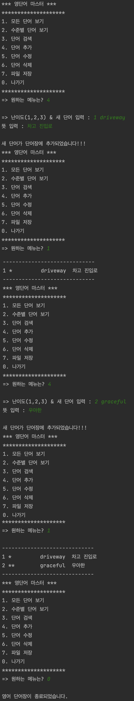
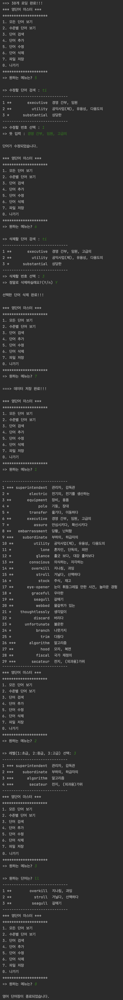

# word-dictionary-crud-java
create CRUD and manage a file with SQLite database in Java program 

## Table of Contents
- [Table of Contents](#table-of-contents)
- [Scenario](#scenario)
- [Key Features](#key-features)
- [Team ✨](#team-)
- [How To Use](#how-to-use)
- [Tool](#tool)
- [Related](#related)

## 📡 Scenario
---------------------------
#### Create and Read the data

#### Update and Delete and search the data

## Key Features
----------------------------
Create, Read, Update, Delete and search the word from text files or SQLite database.